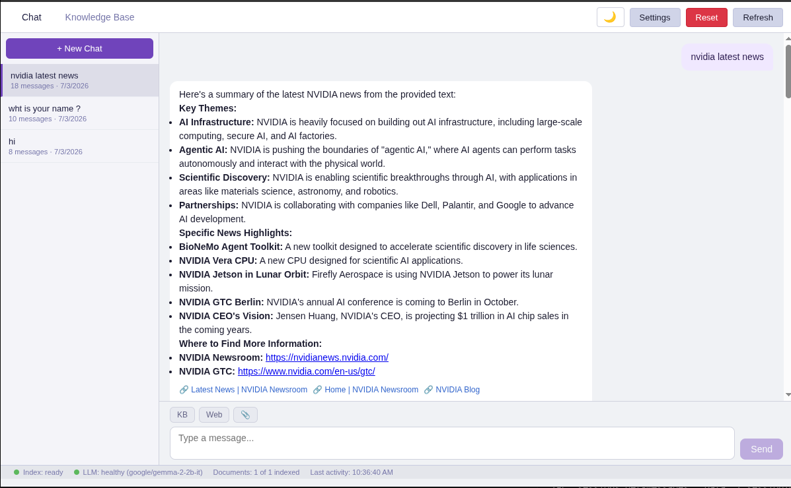
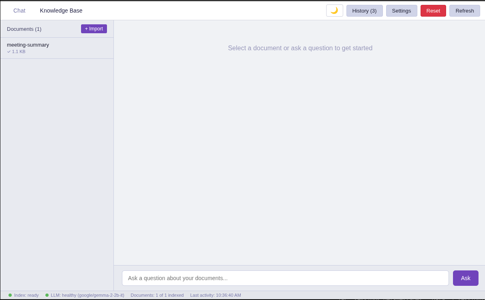
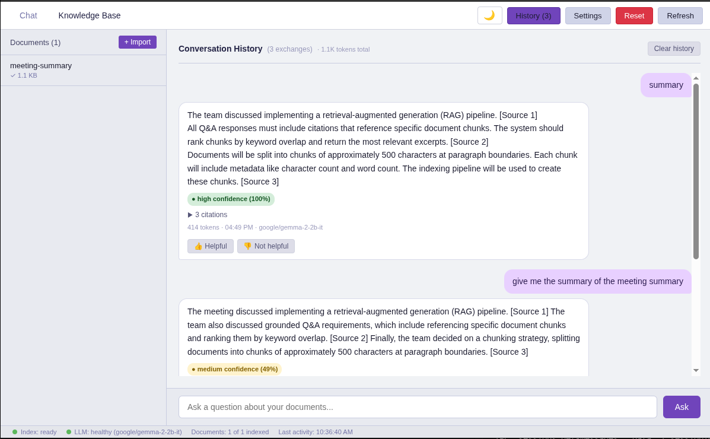

# Knowledge Base — Session-Based Q&A with LLM Integration

A desktop application for managing a personal knowledge base. Import text and Markdown documents, index them into searchable chunks with BM25 + vector embeddings, and ask grounded questions powered by LLM answer generation (NVIDIA NIM) with session-based conversations.

## UI Screenshots

| Chat Interface | Knowledge Base View | Q&A History |
|:---:|:---:|:---:|
|  |  |  |

## Features

### Session-Based Chat
- **Multi-session conversations** — Create, rename, archive, and delete sessions
- **Auto-title** — Automatically titles sessions based on the first message
- **Streaming answers** — LLM-generated answers streamed token-by-token via SSE
- **Markdown rendering** — Answers rendered with full Markdown support
- **Message tools** — Per-message tool selection: KB RAG, Web Search, File Upload
- **Cancellable streaming** — Stop answer generation mid-stream

### Document Management
- **Import documents** — Add `.txt` and `.md` files via native Electron file picker
- **File validation** — Existence check and 10 MB size limit
- **Rich metadata** — Title, filename, size, import date, word count, line count, file type, and indexing status
- **Content viewing** — Browse full document content with chunk details
- **Document deletion** — Cascading SQLite deletes

### Text Indexing
- **Smart chunking** — Split documents into ~500-character chunks at paragraph boundaries
- **Hybrid retrieval** — BM25 FTS5 keyword search + 384-dim vector embeddings via `all-MiniLM-L6-v2`
- **Reciprocal Rank Fusion** — Merges BM25 and vector results with configurable RRF constant
- **Three retrieval modes** — Hybrid (default), BM25-only, or vector-only
- **Local embeddings** — All embeddings computed locally via `@xenova/transformers`

### Grounded Q&A with Citations
- **Cited answers** — Every answer includes references to specific document chunks
- **Dynamic confidence scores** — Derived from fused score distribution
- **KB view mode** — Dedicated grounded Q&A panel with chunk details and rank badges
- **Persistent history** — Full Q&A history saved to SQLite

### Web Search Integration
- **Tavily API** — Real-time web search results in chat
- **Configurable** — Toggle on/off per message

### File Upload for Chat Context
- **Text extraction** — Upload files to provide context for the LLM
- **Supported formats** — `.txt`, `.md`, `.pdf`, `.docx`, `.json`

### LLM Answer Generation
- **NVIDIA NIM** — Streaming LLM inference via NVIDIA's hosted API
- **Configurable model** — Model selection via settings
- **Streaming** — Token-by-token markdown rendering

### Theme Toggle
- **Dark/Light** — System-preference-aware theme with CSS custom properties
- **Persistent** — Theme choice saved across sessions

### Feedback Collection
- **Thumbs up/down** — Rate Q&A responses directly in chat
- **Persistent** — All ratings saved to SQLite

### Clean State Reset
- **One-click reset** — Clear all data from the application header
- **Complete cleanup** — Removes entire data directory

### Full SQLite Persistence
- **Single database file** — WAL journaling with foreign key constraints
- **Auto-load on startup** — Sessions, documents, and history load automatically
- **Versioned migrations** — Schema version tracked in `schema_meta`

### Real-Time Status Bar
- **Document/index status** — Visual indicator with color-coded dot
- **Last activity** — Timestamp of most recent operation

## Architecture

```
Renderer (React)
    ↕ window.knowledgeBase.* (typed IPC bridge via contextBridge)
Preload Script
    ↕ ipcRenderer.invoke(IPC_CHANNELS.*)
Main Process (IPC handlers)
    ↕ Service method calls
Services Layer (business logic)
    ├─ PersistenceService  — JSON/text I/O, clean state reset
    ├─ DocumentService     — Document CRUD, metadata extraction
    ├─ IndexingService     — Chunking, SQLite inserts, embedding generation
    ├─ EmbeddingService    — all-MiniLM-L6-v2 (384-dim)
    ├─ Retriever           — hybridSearch (BM25 + vector + RRF)
    ├─ QaService           — Grounded Q&A with citations
    ├─ ChatService         — Session messages, streaming communication
    ├─ SessionService      — Session CRUD, auto-title
    ├─ LLMService          — NVIDIA NIM streaming inference
    ├─ WebSearchService    — Tavily API integration
    ├─ SettingsService     — Retrieval settings CRUD
    ├─ ThemeService        — Dark/light theme management
    └─ Logger              — Structured JSON logging
```

### Electron Layer Boundaries

| Layer | Location | Responsibilities |
|-------|----------|-----------------|
| Main Process | `src/main/` | BrowserWindow, IPC registration, filesystem access |
| Preload | `src/preload/` | Typed `contextBridge` API bridge |
| Renderer | `src/renderer/` | React UI, communicates via `window.knowledgeBase` |
| Services | `src/services/` | Pure TS business logic, constructor-injected PersistenceService |

### Data Flow (Chat)

```
User types message → ChatView → window.knowledgeBase.chat.send(sessionId, message, tools)
    → IPC chat:send → ChatService → LLMService.stream(model, messages, tools?)
    → IPC chat:stream-chunk (tokens) → ChatView renders streaming text
    → IPC chat:stream-done (final) → ChatView finalizes message
```

## Getting Started

### Prerequisites

- Node.js 18+ and npm
- Linux, macOS, or Windows
- C++ build tools (for native module compilation)
- NVIDIA NIM API key (for LLM features)
- Tavily API key (for web search)

### Installation

```bash
bash init.sh
```

This installs dependencies, rebuilds native modules, runs type checks, and builds the project.

### Configuration

Copy `.env.example` to `.env` and add your API keys:

```
NVIDIA_API_KEY=nvapi-...
TAVILY_API_KEY=tvly-...
```

### Running the App

```bash
npm run dev
```

### Development

```bash
npm run check    # Type checking
npm run build    # Production build
npm test         # Run all 204 tests
```

## The Harness

This project includes a comprehensive development harness for AI agents and human developers:

### Core Files

- **AGENTS.md** — Startup rules, layer boundaries, conventions, and definition of done
- **feature_list.json** — Current status of all 53 features with evidence
- **init.sh** — Project initialization and verification script

### Documentation

- **docs/ARCHITECTURE.md** — Electron layers, data flow, IPC channels, storage layout
- **docs/PRODUCT.md** — Feature requirements and user-facing behavior
- **docs/RELIABILITY.md** — Logging, observability, clean state, and benchmarking

### Quality Control

- **clean-state-checklist.md** — Verification checklist for testing cycles
- **evaluator-rubric.md** — Grading criteria for code quality
- **quality-document.md** — Comprehensive quality assessment
- **session-handoff.md** — Context for resuming work across sessions
- **agent-progress.md** — Implementation log with learnings and decisions

### Performance & Maintenance

#### Benchmark Scripts

```bash
bash scripts/benchmark.sh
```

Measures import throughput, indexing speed, query latency, and data integrity.

#### Cleanup Scanner

```bash
bash scripts/cleanup-scanner.sh
```

Checks for orphaned files, dangling chunks, missing content, and stale references.

### Structured Logging

All services emit structured JSON logs. Set log level via environment:

```bash
LOG_LEVEL=INFO npm run dev
```

## Project Status

**53 of 53 features complete.** All features pass with documented evidence in `feature_list.json`.

| Category | Features | Status |
|----------|----------|--------|
| Core | Window, Document List, Question Panel, Data Directory, Import, Detail, Basic Persistence, Chunking, Metadata, Indexing Status | ✓ pass (10) |
| Chat | Chat Pivot, Session CRUD, Auto-Title, Streaming, Multi-Tool, Cancellation, Chat Session Persistence | ✓ pass (10) |
| Q&A | Grounded Q&A, Citations, Confidence, Conversation History, Feedback | ✓ pass (5) |
| KB View | KB Reset, KB RAG Display, KB Q&A Source, KB Toggle, KB Indexing | ✓ pass (5) |
| Web Search | Tavily Integration, Web Search Tool, Web Source Display, Web + KB Combined | ✓ pass (4) |
| File Upload | File Upload Tool, Text Extraction, File Preview in Chat | ✓ pass (3) |
| LLM | NVIDIA NIM, Model Selection, Chunk Caching, API Key Validation, Embedding Key | ✓ pass (5) |
| UX | Theme Toggle, Settings Panel, LLM Settings, Settings Persistence | ✓ pass (4) |
| Infrastructure | Clean State Reset, Data Reset, Benchmark, Cleanup Scanner | ✓ pass (4) |
| Tooling | Complete Harness, Feature Tracker, Pipeline | ✓ pass (3) |

**Test coverage:** 204 tests across 24 test files — all passing.

## Performance Targets

- **Import throughput:** 10+ files per batch under 1 second
- **Indexing speed:** 100+ chunks per second
- **Embedding throughput:** 750+ texts per second (batch)
- **Query latency:** Under 500ms retrieval, LLM streaming adds token-by-token latency

## Constraints

- Maximum file size: 10 MB
- Supported formats: `.txt`, `.md`, `.pdf`, `.docx`, `.json`
- LLM features require NVIDIA NIM API key
- Web search requires Tavily API key
- All document data is local
- Embeddings computed locally

## License

Demonstration project for AI-assisted development workflows.

## Contributing

1. Read `AGENTS.md` for conventions and boundaries
2. Read `docs/ARCHITECTURE.md` for system structure
3. Run `bash init.sh` to verify your setup
4. Run `bash scripts/benchmark.sh` before and after changes
5. Run `bash scripts/cleanup-scanner.sh` to verify data integrity
6. Update `feature_list.json` with evidence when completing features
7. Update relevant docs when adding features
